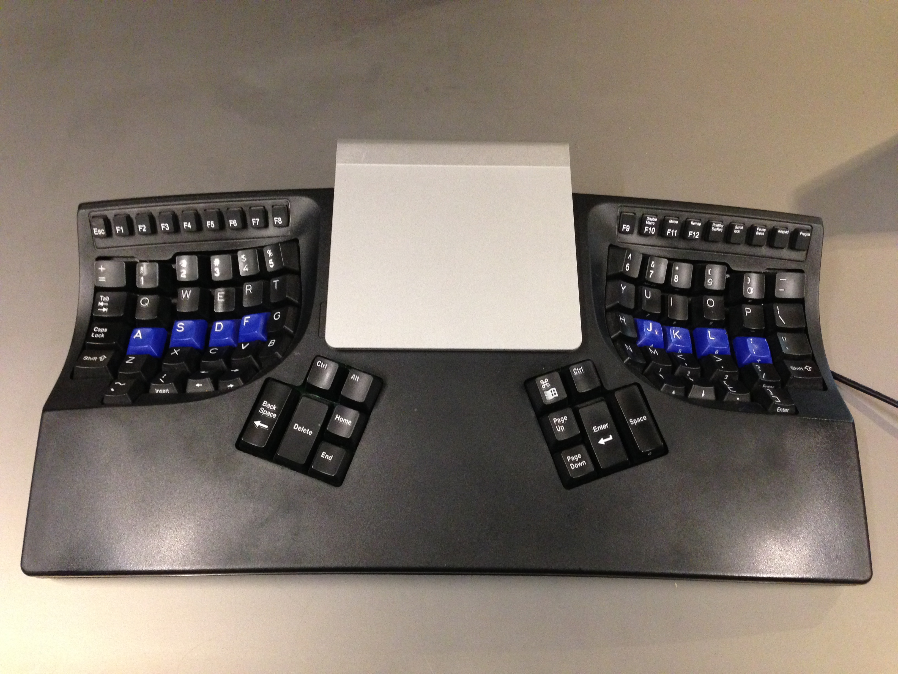
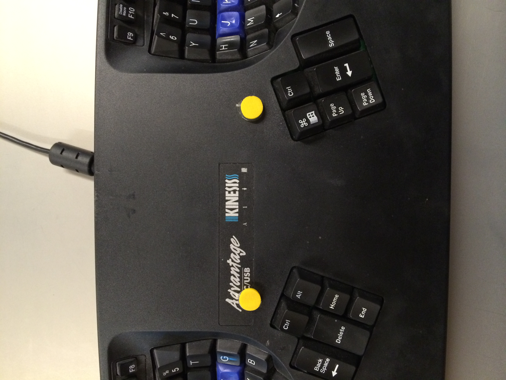

# tracknesis

The elegance of a Apple trackpad combined with the power of a Kinesis
keyboard.

## Assembly

Print a `tracknesis-center`, a `tracknesis-left`, a `tracknesis-right`, a `connector` and two `tracknesis-foot` models in a Makerbot Replicator 2 at medium
quality & 15% density.

Hot glue the two feet to the keyboard so that they line up with the clickers
on the bottom of the trackpad.

Snap the `tracknesis-center` onto the back edge of the keyboard. Finally, slide the trackpad into the three pieces.

## Thanks

Trackpad holder is borrowed from the [Apple Wireless Keyboard and Magic
Trackpad joiner](http://www.thingiverse.com/thing:22930) by @thingibox.
